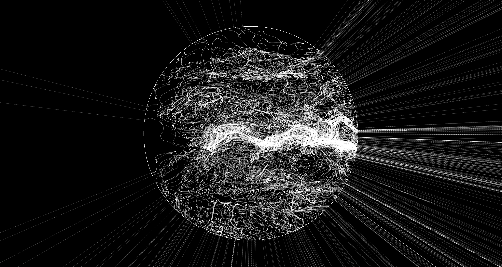

# Limits

Welcome to Limits, a mesmerizing piece of creative coding art crafted with p5.js!

### Description

Limits is a mesmerizing generative art piece that explores the delicate interplay between structure and chaos. Inspired by the concept of nodes colliding within an ethereal boundary, this animation offers a captivating visualization of dynamic interactions and fluid movements. Each point dances around a central void, creating an ever-evolving network of connections that blurs the line between order and randomness. Perfect for enthusiasts of abstract art and computational creativity, this piece invites viewers to lose themselves in its intricate patterns and endless possibilities.

### Usage

1. Clone the repository to your local machine.

2. Open index.html in a web browser.

3. Watch in awe as the Infinite Vortex mesmerizes you with its hypnotic motion.

### Credits

Inspired by ["Into the Void" by Black Sabbath](https://open.spotify.com/intl-es/track/09EQqFGUTJW6X4NksMPM0O?si=200bb08296924c9d).

### License

This project is licensed under the [MIT License](LICENSE).